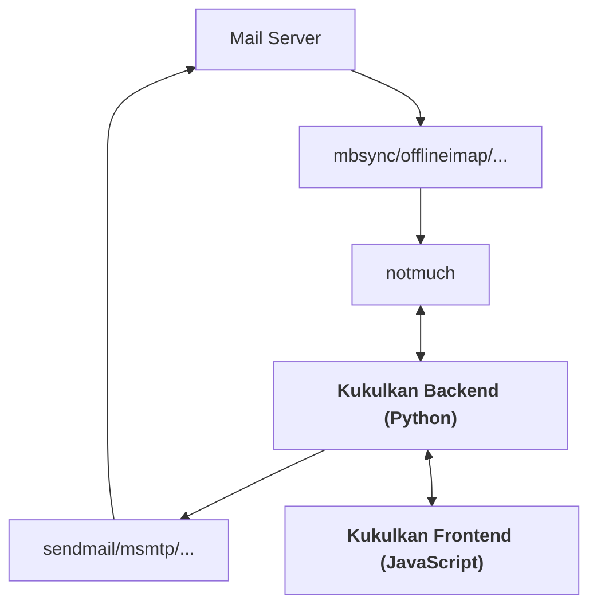

# Kukulkan


Email Client for Notmuch

## Main Features

- integrates with [notmuch](https://notmuchmail.org) and sendmail/msmtp/...
- fast and responsive web interface
- all search queries/thread IDs/message IDs/etc part of URL, i.e. you can
  bookmark "views"
- thread/message subject set as page title, i.e. you can search through your
  emails by typing in your browser search bar
- autocomplete notmuch queries, including history of previous queries, tags, due
  dates...
- threads can be shown in full or individual "fibers" (complete paths from root
  to leaf in thread tree), thread map for quick overview
- allows to filter "CAUTION EXTERNAL EMAIL" and similar stuff from emails
- filters trackers etc in HTML email
- GPG and S/MIME verification support, S/MIME signing support
- email templates
- external editor support
- TODO view -- lists emails tagged "todo", sorted by due date (specified in
  another tag), shows calendar overview and time until due
- keyboard shortcuts available for all actions
- lots of tests for backend and frontend

Kukulkan uses some features that require a recent browser (e.g. CSS relative
colors) and does not provide any backwards compatibility for older browsers.
If you are not running a recent browser, things may break.

## Installation

Assumes that you have [notmuch](https://notmuchmail.org) installed and working.
You may need to install additional Python packages (in
[requirements.txt](https://github.com/larskotthoff/kukulkan/blob/main/server/requirements.txt))
and (for development only) node and the required node packages.

For the production version (e.g. a release), it should be sufficient to serve
the `prod/` directory through a suitable WSGI container, e.g. `gunicorn
'kukulkan.prod.kukulkan:create_app()'`. When using gunicorn, make sure not to
use the default "sync" worker as this breaks the async requests necessary to
show progress when sending. The files in `prod/static` were created using `npm
run build` in the `src/client` directory.

If your notmuch configuration is a non-standard place, you can specify this by
setting the NOTMUCH_CONFIG environment variable. Note that the Python API only
picks up options that are included in the database. You may have to run e.g.

````
notmuch config set --database search.exclude_tags 'deleted'
````

### Development

To set up the development environment, install the depencies by running `pip
install -r requirements.txt` (or whatever is suitable for you) in the `server/`
directory and `npm i` in the `client/` directory.

Start the server with `FLASK_APP=kukulkan FLASK_DEBUG="true" flask run` and the
client with `npm start` in the respective directories. The `FLASK_DEBUG` option
is necessary to correctly serve templates, which are used to reduce the number
of requests.

The `deploy.sh` script automates building the production version and deployment
to the `prod/` directory.

## Configuration

The configuration is assumed to be at $XDG_CONFIG_HOME/.config/kukulkan/config;
an example configuration is provided in
[config-example](https://github.com/larskotthoff/kukulkan/blob/main/config-example).

Accounts that have `key` set will use this S/MIME key to sign sent emails. This
only works if the key is not password protected. The `filter` key allows to
specify what content in text/html and text/plain to replace; the second string
in the array is what to replace it with (leave empty to remove matches).

````
{
    "accounts": [ # define at least one account
        {
            "id": "foo", # internal ID, can be set arbitrarily
            "name": "My Name",
            "email": "foo@bar.com",
            "key": "/path/to/key.key", # optional
            "cert": "/path/to/cert.cert", # optional
            "sendmail": "msmtp --account=foo -t",
            "default": "true",
            "save_sent_to": "/path/to/mail/foo/cur/", # where should saved mail be put
            "additional_sent_tags": [ "foo" ] # tags to apply in addition to the ones specified in the user interface
        },

        {
            "id": "bar",
            "name": "Foo Bar",
            "email": "bar@foo.com",
            "sendmail": "msmtp --account=bar -t",
            "default": "false", # can also be omitted if false
            "save_sent_to": "/path/to/mail/bar/cur/",
            "additional_sent_tags": [ "bar" ]
        }

    ],

    "gpg-keyserver": "keyserver.ubuntu.com",
    "ca-bundle": "/etc/ca-certificates/extracted/email-ca-bundle.pem", # for S/MIME verification
    # if you're running Kukulkan on a different machine to where your browser is
    # and you want external editing on the browser machine, set this to true
    "allow-cross-origin-write": "true",

    "filter": {
        "content": {
            "text/html": [ "<p>spam banner to be removed</p>", "" ],
            "text/plain": [ "Some warning that message was from external source.", "" ]
        }
    },

    "compose": {
        "external-editor": "command that will be suffixed with file name", # for example "nvim-qt --nofork"

        "templates": [
            {
                "shortcut": "1", # key to press in write view
                "description": "foo", # description shown in write view
                "template": "Thank you for your message." # body of email
            }
        ]
    }

}
````

### External Editor Support

External editing works by making a request to a designated endpoint on the
server, which then spawns the external editor with a temporary file, waits for
the process to complete, and returns the contents of that same file to the
client.

There are two ways to make this work:
- The Kukulkan server runs on the same machine as the browser, and was started
  from a GUI environemnt (e.g. X11, wayland). The server will call the
  configured external editor and editing should work as expected.
- The Kukulkan server runs on a different machine than the browser. You can run
  another Kukulkan server on the same machine as your browser (doesn't need
  access to your mail) with an external editor configured. In the client
  settings page, change "When composing, use" to "external editor on localhost".
  This will make the request for the external editor to locahost instead of
  whatever machine the server is running on, and should work as above. Note that
  the protocol and port needs to be the same as for the remote server, and in
  the remote server configuration you need to have set
  `allow-cross-origin-write` to `true` (the external editor configuration on the
  remote server doesn't matter though).

## Usage

Demo at
[https://kukulkan-840786380000.us-west1.run.app/](https://kukulkan-840786380000.us-west1.run.app/),
with the [notmuch mailing list archive](https://nmbug.notmuchmail.org/archive/notmuch-list.tar.xz).

Note that by default, actions that go to a new page (open thread, reply, etc)
open a new tab, so you may need to allow this. You can change this in settings.
Also note that whenever an autocompletion popup is visible, Enter selects the
currently active completion, but does not perform the action (search for query,
apply tag, etc) -- press Enter again to apply the action. Escape closes the
autocomplete dialog without selecting a completion.

### Main View


Query notmuch database for threads (try `tag:unread` or `date:"this month"`).

Shortcuts:
- Enter: open thread view
- Home: go to top of thread list
- End/0: to to end of thread list
- k/up: go up one
- K: go up ten
- j/down: go down one
- J: go down ten
- c: open compose view with new email
- s: go to settings
- /: focus search box and select all text
- Space: mark currently active thread
- t/swipe right until # appears: open tagging box for active/marked threads
- Delete/swipe left until trash appears: tag active/marked threads with "deleted"; remove "unread" tag

In the tagging box, enter the list of tags to apply and remove (prefix with
"-"), then press Enter to apply changes. Press Escape to close without making
changes.

### TODO View


Shows threads tagged "todo". Due dates for TODOs can be specified by applying a
tag of the format `due:<year>-<month>-<day>`, e.g. "due:2025-02-01". You can
enter dates in natural language (English) and they will autocomplete to this
format, e.g. "due:next Friday" or "due:Jan 27". If there are threads tagged with
a due date, a calendar will be shown on the left with marks when TODOs are due.
Threads are ordered by due date, soonest first, with all threads without a due
date at the end.

Note that if there are no threads tagged "todo", nothing will be shown.

Shortcuts:
- Enter: open thread view
- Home: go to top of thread list
- End/0: to to end of thread list
- k/up: go up one
- K: go up ten
- j/down: go down one
- J: go down ten
- c: open compose view with new email
- s: go to settings
- /: focus search box and select all text
- Space: mark currently active thread
- t/swipe right until # appears: open tagging box for active/marked threads
- Delete: tag active/marked threads with "deleted"; remove "unread" tag
- d/swipe left until check mark appears: mark thread done -- remove "todo" and any "due:*" tags

Available at `/todo`
([https://kukulkan-840786380000.us-west1.run.app/todo](https://kukulkan-840786380000.us-west1.run.app/todo)).

### Thread View


Shows messages in a thread. Threads are broken up into fibers by default, i.e.
complete paths from the leaves of the thread tree to the root (you can change
this in settings). Each fiber represents an unbroken conversation. On the left,
a thread map is shown that displays the different fibers and individual
messages. Message boxes are colored depending on the from/to/cc headers, the
subject, and any tags applied to the message to make it easy to identify when
people were added/dropped, the subject changed, etc. The y position of a message
box is determined by the temporal order in the thread, the x position by the
fiber it belongs to. All but the active fiber (whose messages are shown) are
shown with reduced opacity.

Shortcuts:
- Home/1: go to first message in fiber
- End/0: to to last message in fiber
- k/up: go up one
- K: go up ten
- j/down: go down one
- J: go down ten
- h/left/swipe right: activate lower-depth fiber
- l/right/swipe left: activate higher-depth fiber
- F: toggle between fiber and flat views
For the active message:
- r: open compose view to reply all
- R: open compose view to reply sender
- f: open compose view to forward
- t: focus tag input to change tags
- c: toggle between displaying plain text and HTML content
- e: toggle expanded/abbreviated quoted text in plain text view
- Delete: apply tag "deleted", remove tag "unread"
- p: open print view of message
- s: open security view of message (checks DMARC etc, requires [mailauth](https://github.com/postalsys/mailauth))
- w: open raw message (unparsed text of the message file)
- ?: open main view with query from:<sender of message>

Click on tags to remove them, or press Backspace in the tag edit field to
remove the last tag.

### Compose View


Write new email, either from scratch or replying/forwarding an existing message.

Shortcuts:
- a: attach file to message
- b: focus text body input (may open external editor depending on settings)
- y: send message
- d: delete draft saved in `localStorage`

Templates can be applied by pressing the defined key -- there is no check
whether this overlaps with existing shortcuts.

Click on addresses/tags to remove them, or press Backspace in the respective
edit field to remove the last address/tag.

### Settings

Available at `/settings`
([https://kukulkan-840786380000.us-west1.run.app/settings](https://kukulkan-840786380000.us-west1.run.app/settings)).
Should be self-explanatory; settings are stored in `localStorage`, i.e. specific
to the browser you are using.


### General Architecture



## Credits

The UI was inspired by [astroid](https://github.com/astroidmail/astroid/), the server was inspired by [netviel](https://github.com/DavidMStraub/netviel).

Test emails from the [notmuch repository](https://git.notmuchmail.org/git?p=notmuch;a=tree;f=test/corpora), the [Python EML parse module](https://github.com/GOVCERT-LU/eml_parser/tree/master/samples), the [Apache James Project](https://github.com/xishian/james-project/tree/main/mailbox/store/src/test/resources/eml), [Expresso Livre 3](https://github.com/emersonfaria/ExpressoLivre3/tree/master/tests/tine20/Felamimail/files), [ripgrep](https://github.com/phiresky/ripgrep-all/tree/b4dbe1b8e802a8139cca33a4640ed99fded5cbe3/exampledir), and [Simple Java Mail](https://github.com/bbottema/simple-java-mail/tree/master/modules/simple-java-mail/src/test/resources/test-messages).

The favicon is from [here](https://mayadecipherment.com/2017/05/01/a-note-on-the-sign-for-tzihb-writing-painting/?amp=1) (thanks Colleen); the background image is Justin Kerr's drawing of [Yaxchilan lintel 15](https://www.britishmuseum.org/collection/object/E_Am1923-Maud-1).
